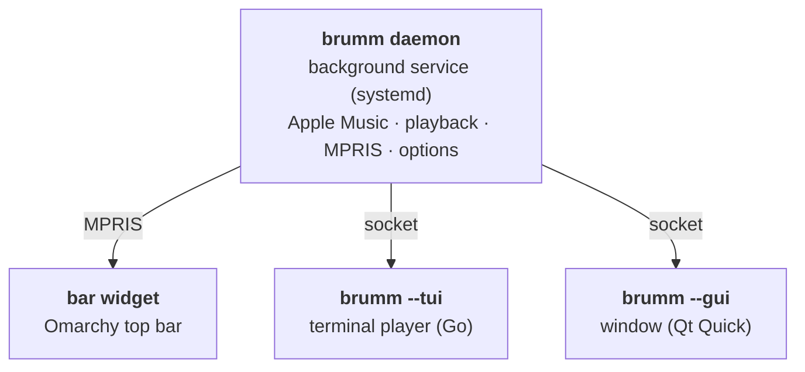

# ʕ•ᴥ•ʔ brumm

**Apple Music for [Omarchy](https://omarchy.org).** Full tracks, your theme's colors — in your terminal *and* as a window.

### ⇄ Terminal or window: switch any time with <kbd>g</kbd>

brumm is one player with two faces. `brumm --tui` is the terminal player, `brumm --gui` the window, lit like the PSP's XMB. Press <kbd>g</kbd> in either and you are in the other — same keys, same queue, and the music never stops. Whichever you used last is what `brumm` and the launcher open.


<div align="center">

```sh
curl -fsSL https://github.com/chriopter/brumm/releases/latest/download/install.sh | bash
brumm login
```

</div>

## Features

- 🎵 Library, catalog, search as you type
- 🏠 Home: recent, heavy rotation, picks, charts
- 📻 Radio: your station, live, any song
- 🎤 Artists: top songs, releases, similar ones
- ♥ Love, dislike, library, playlists
- 🖼 Covers: pixel art, smooth, or real
- 🌈 Twelve visualizers that hear the kick
- ⌨️ <kbd>?</kbd> for keys, mouse works everywhere
- 🔋 Nearly idle while paused
- 🐧 Theme colors, media keys, bar widget
- ⇄ Terminal and window, <kbd>g</kbd> to switch, music plays on


## Keys

| | |
|---|---|
| <kbd>enter</kbd> | play / open |
| <kbd>space</kbd> | pause · hold to preview |
| <kbd>←</kbd> <kbd>→</kbd> <kbd>1</kbd>–<kbd>8</kbd> | sections |
| <kbd>/</kbd> | filter here · <kbd>tab</kbd> search everywhere |
| <kbd>R</kbd> | radio from song or artist |
| <kbd>*</kbd> <kbd>d</kbd> <kbd>i</kbd> <kbd>P</kbd> | love · dislike · library · playlist |
| <kbd>f</kbd> | visualizer: <kbd>tab</kbd> <kbd>v</kbd> <kbd>a</kbd> <kbd>F</kbd> |
| <kbd>g</kbd> | switch between terminal and window |
| <kbd>o</kbd> | options |
| <kbd>U</kbd> | look for an update |
| <kbd>Q</kbd> / <kbd>q</kbd> | close, keep playing / quit |

Not possible with Apple's API: deleting or renaming playlists, lyrics, lossless.

## Installing, in detail

`brumm login` opens the player once you are signed in. Later, run `brumm` or click the music widget in the bar. You need an Apple Music subscription.

The window is a Qt Quick app in the spirit of the PSP's XMB, lit in the colors of your Omarchy theme and of the cover, with the terminal player's twelve visualizer styles (<kbd>f</kbd>) redrawn as shaders. It draws only what changes: in the background it stands still.

To check the installer before running it, download it, verify that GitHub built it from this repository, then run it:

```sh
curl -fsSLO https://github.com/chriopter/brumm/releases/latest/download/install.sh
gh attestation verify install.sh -R chriopter/brumm
bash install.sh
```

## Update

brumm checks for a new version every time it starts; press <kbd>U</kbd> when it offers one. Or run `brumm update`.

Updates are signed: brumm and the installer only install a release whose checksums carry this project's Ed25519 signature for that exact version. Every build also has a GitHub attestation (`gh attestation verify brumm-linux-amd64.tar.gz -R chriopter/brumm`).

Inspired by [vibez](https://github.com/simonepelosi/vibez).

## Development

```sh
bin/setup     # Build and install from this checkout (the window too, with Qt 6)
bin/dev       # Run the daemon in the foreground (`bin/dev ui` the TUI, `bin/dev gui` the window)
bin/gui-shot  # Screenshot the window against a stand-in daemon (tools/fakedaemon)
bin/update    # Pull and reinstall
```

One background service plays the music; everything you see talks to it, and each can come and go while the music plays on:


