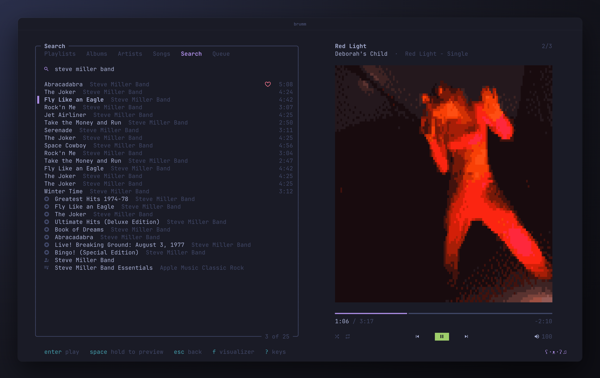

# ʕ•ᴥ•ʔ brumm

**Apple Music for [Omarchy](https://omarchy.org).** Full tracks, pixel-art covers, your theme's colors.



## Features

- 🎵 Library, catalog, search as you type
- 🏠 Home: recent, heavy rotation, picks, charts
- 📻 Radio: your station, live, any song
- 🎤 Artists: top songs, releases, similar ones
- ♥ Love, dislike, library, playlists
- 🖼 Covers: pixel art, smooth, or real
- 🌈 Twelve visualizers that hear the kick
- ⌨️ <kbd>?</kbd> for keys, mouse works everywhere
- 🔋 Nearly idle while paused
- 🐧 Theme colors, media keys, bar widget


## Keys

| | |
|---|---|
| <kbd>enter</kbd> | play / open |
| <kbd>space</kbd> | pause · hold to preview |
| <kbd>←</kbd> <kbd>→</kbd> <kbd>1</kbd>–<kbd>8</kbd> | sections |
| <kbd>/</kbd> | filter here · <kbd>tab</kbd> search everywhere |
| <kbd>R</kbd> | radio from song or artist |
| <kbd>*</kbd> <kbd>d</kbd> <kbd>i</kbd> <kbd>P</kbd> | love · dislike · library · playlist |
| <kbd>f</kbd> | visualizer: <kbd>tab</kbd> <kbd>v</kbd> <kbd>a</kbd> <kbd>F</kbd> |
| <kbd>o</kbd> | options |
| <kbd>U</kbd> | look for an update |
| <kbd>Q</kbd> / <kbd>q</kbd> | close, keep playing / quit |

Not possible with Apple's API: deleting or renaming playlists, lyrics, lossless.

## Install

```sh
curl -fsSL https://github.com/chriopter/brumm/releases/latest/download/install.sh | bash
brumm login
```

`brumm login` opens the player once you are signed in. Later, run `brumm` or click the music widget in the bar. You need an Apple Music subscription.

To check the installer before running it, download it, verify that GitHub built it from this repository, then run it:

```sh
curl -fsSLO https://github.com/chriopter/brumm/releases/latest/download/install.sh
gh attestation verify install.sh -R chriopter/brumm
bash install.sh
```

## Update

brumm checks for a new version every time it starts; press <kbd>U</kbd> when it offers one. Or run `brumm update`.

Updates are signed: brumm and the installer only install a release whose checksums carry this project's Ed25519 signature for that exact version. Every build also has a GitHub attestation (`gh attestation verify brumm-linux-amd64.tar.gz -R chriopter/brumm`).

Inspired by [vibez](https://github.com/simonepelosi/vibez).

## Development

```sh
bin/setup   # Build and install from this checkout
bin/dev     # Run the daemon in the foreground (`bin/dev ui` for the TUI)
bin/update  # Pull and reinstall
```
