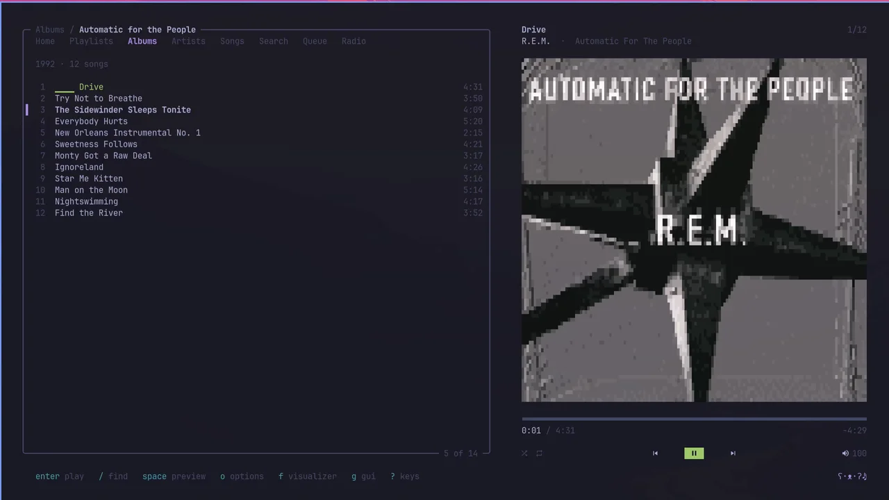
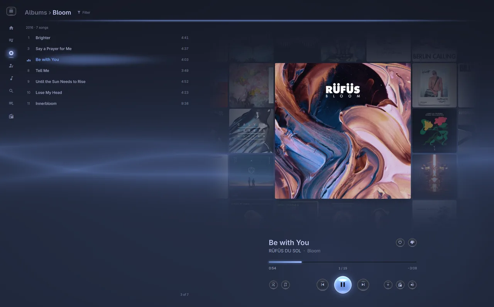
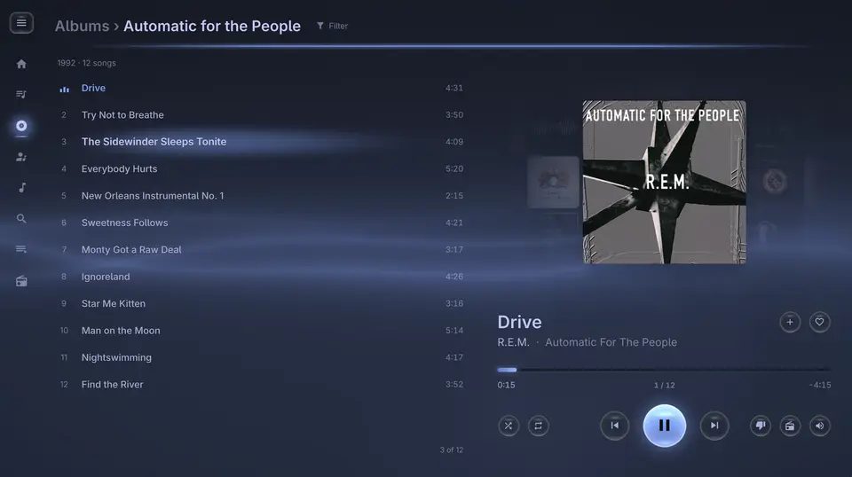
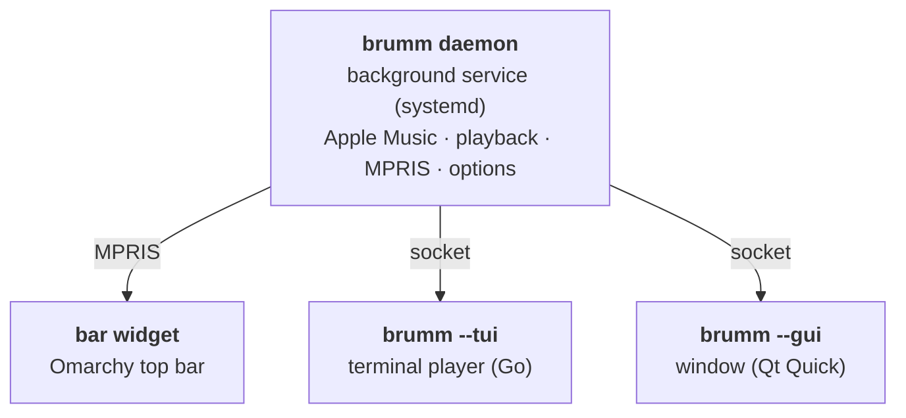

# ʕ•ᴥ•ʔ brumm


**Apple Music for [Omarchy](https://omarchy.org) with GUI & TUI**

- 🎵 Library, catalog, search as you type
- 🏠 Home: recent, heavy rotation, picks, charts
- 📻 Radio: your station, live, any song
- 🎤 Artists: top songs, releases, similar ones
- ♥ Love, dislike, library, playlists
- 🖼 Covers: pixel art, smooth, or real
- 🌈 Twelve visualizers that hear the kick
- ⌨️ <kbd>?</kbd> for keys, mouse works everywhere
- 🔋 Nearly idle while paused
- 🐧 Theme colors, media keys, bar widget
- ⇄ Terminal and window, <kbd>g</kbd> to switch, music plays on
- 🎹 <kbd>Super</kbd>+<kbd>Shift</kbd>+<kbd>M</kbd> opens brumm instead of Spotify, if you like — `brumm keys on|off`

## Install

```sh
curl -fsSL https://github.com/chriopter/brumm/releases/latest/download/install.sh | bash
```


GUI


TUI


Visuals

## Keys

| | |
|---|---|
| <kbd>enter</kbd> | play / open |
| <kbd>space</kbd> | pause · hold to preview |
| <kbd>←</kbd> <kbd>→</kbd> <kbd>1</kbd>–<kbd>8</kbd> | sections |
| <kbd>/</kbd> | filter here · <kbd>tab</kbd> search everywhere |
| <kbd>R</kbd> | radio from song or artist |
| <kbd>*</kbd> <kbd>d</kbd> <kbd>i</kbd> <kbd>P</kbd> | love · dislike · library · playlist |
| <kbd>f</kbd> | visualizer: <kbd>tab</kbd> <kbd>v</kbd> <kbd>a</kbd> <kbd>F</kbd> |
| <kbd>g</kbd> | switch between terminal and window |
| <kbd>o</kbd> | options |
| <kbd>U</kbd> | look for an update |
| <kbd>Q</kbd> / <kbd>q</kbd> | close, keep playing / quit |

Not possible with Apple's API: deleting or renaming playlists, lyrics, lossless.

## More

- 🔑 Needs an Apple Music subscription; the installer signs you in and starts brumm
- ▶️ Later: `brumm`, the launcher, or the bar widget — whichever face you used last
- 🔄 Updates: <kbd>U</kbd> when offered, or `brumm update`
- 🔏 Signed releases (Ed25519) and GitHub-attested builds — check the installer first:

```sh
curl -fsSLO https://github.com/chriopter/brumm/releases/latest/download/install.sh
gh attestation verify install.sh -R chriopter/brumm && bash install.sh
```

## Development

```sh
bin/setup     # build and install from this checkout (the window too, with Qt 6)
bin/dev       # the daemon in the foreground; bin/dev ui / gui for a player
bin/gui-shot  # screenshot the window against a stand-in daemon
bin/bench     # what the players cost
```

One background service is the core — music, queue, library, options, sign-in, where you were. The players only draw, and come and go while the music plays on:



CPU, share of one core (`bin/bench`):

| | paused | playing | visualizer |
|---|---|---|---|
| terminal | 1 % | 3 % | 8 % |
| window | 0 % | 2 % | 6 % |

The terminal rebuilds only the lines that changed; the window hands its drawing to the GPU, which these figures leave out.

Inspired by [vibez](https://github.com/simonepelosi/vibez).
